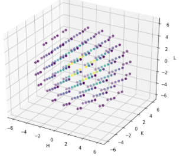

# Convolutional Neural Networks for X-Ray Crystallography
Series of notebooks used to create a large dataset of 10000+ crystals, as well as training and testing a complicated model with the dataset.

When recording diffraction data for crystallography, one only obtains the amplitude of the reciprocal space of a given object on the detector. However, in order to obtain all of the information of the object, one needs the amplitude and phase. Phase retrieval, an ubiquitious problem in several fields, is the process of post-processing data to estimate the phase of each pixel in an image. Recently, there have been many efforts to employ machine learning methodlogies to phase retrieval problems. In this presentation, convolutional neural networks will be employed on this complex problem for use in X-ray diffraction experiments.

## The Data

The dataset was made by using Crystallographic Information Files (.cifs) and calculating all of the complex structure factors associated with it for a 10 keV X-ray source.  The conversion from the crystallographic file to X-ray diffrac-tion structure factors was done using a python library named Dan’s Diffraction. We did this for 16 crystals where we shifted the crystals by a random amount given by a normal distribution with a mean of zero and a standard deviation of one twentieth the lattice constant on the a-axis to act as a distortion to the structure factors. 

Figure 1: Structure factors for a Ni crystal plotted in 3D based on HKL space.

Figure 2: Structure factors for a Ni Crystal tiled in 2D before perturbing the crystal (a) and after perturbing the crystal (b).

## Modeling and Analysis

### Loss Function

The primary numerical metric is the loss over a given dataset because it reveals how close the phases are for a given output. The reconstruction of the charge density in the crystal was used as a qualitative metric.

Figure 3: Loss function that was used to evaluate baseline methdos as well as U-net model.

### Baseline Methods

Since applying neural networks to the phase retrieval problem in this particular way is novel, three baseline methods were analyzed. These three are linear regression, a three layer fully connected neural network, and a three layer 3D convolutional neural network. The training, validation, and test losses for all of these models are shown after discussing the U-net model.

## U-net Model

Following the three baseline methods, the popular U-net model was employed. The architecture of the U-net is shown below. 

Figure 4: U-net model architecture.

The U-net architecture uses a series of downsampling blocks using convolutions and upsampling blocks using transpose convolutions. The training and validation loss curves are shown below. The training loss is much lower than than the training loss found for the linear three layer net. Furthermore, there seems to be an overfitting issue since the validation loss is not dropping in the same way as the training loss. As this is still a project in progress, adding layers such as dropout and bathnorm can possibly fix this overfitting issue and are something that is actively being looked into. An important thing to note is that if this issue is resolved, the U-net and convolutional three layer network can be used to accuratley predict the phases.

Figure 5: Training and validation loss curves for U-net model.

The losses for all four models are summarized in the table below. 

Figure 6: Train, validation, and test losses for the four models.

Although the linear regression performed the best, the models with convolutional layers have the potential to perform much better than the linear regression after figuring out how to stop overfitting. 

In order to get a better understanding of what the loss function was quantifying, a qualitative method of understanding the output was evaluated. In this case, figure 7 shows the prediction of one sample made by the U-net model. Once the phases are predicted by the model, a reconstruction of the charge density for a crystal can be made to look for qualitative differences between the correct label, and the prediction. Figure 7 reveals that the phases were predicted relatively well, although there were some mistakes as seen in the top right corner of the cube.  

Figure 7: Reconstruction of charge density using (a) correct phases (label) and (b) phases predicted by the U-net model.

## Conclusion and Future Outlook

Four models were able to predict the phases of the structure factors when given amplitudes of the corresponding structure factors. The models are linear regression, two different three layer nets, and U-net. The three neural networks performed better than linear regression and performed fairly similarly. The first issue that will be addressed is correcting the overfiting problem in the two networks that leverage convolutional layers. Furthermore, more complex crystal systems can be used as input data. The networks that leverage convolutional layers may perform better on the complex crystal systems. 

The goal for this would be to eventually implement this with an X-ray crystallography setup such that at test time one may be able to get an accurate representation of the charge density relatively quickly when measuring X-ray Bragg peaks. This may help X-ray studies where they start with a structure and try to predict the measured charge distribution from X-ray diffraction data taken using a model trained on crystals known to be similar to the sample being measured.